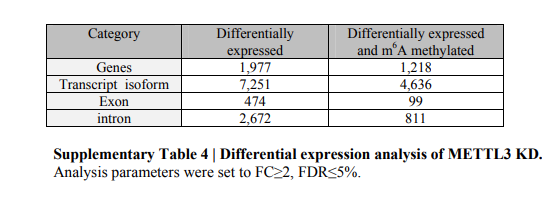
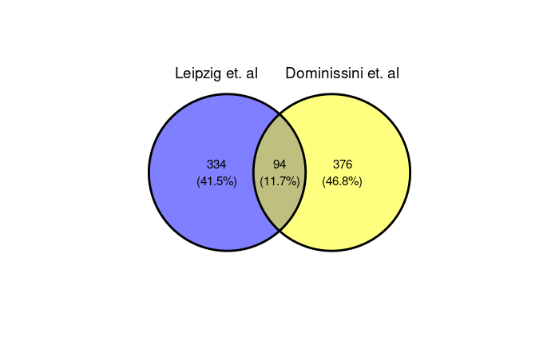
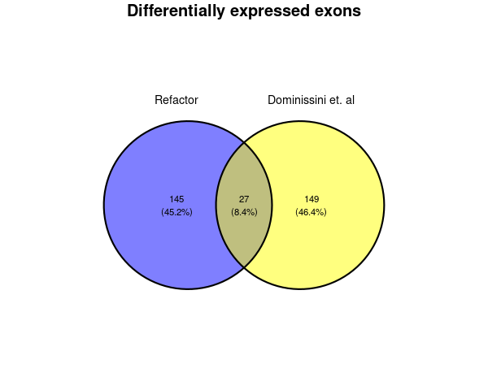
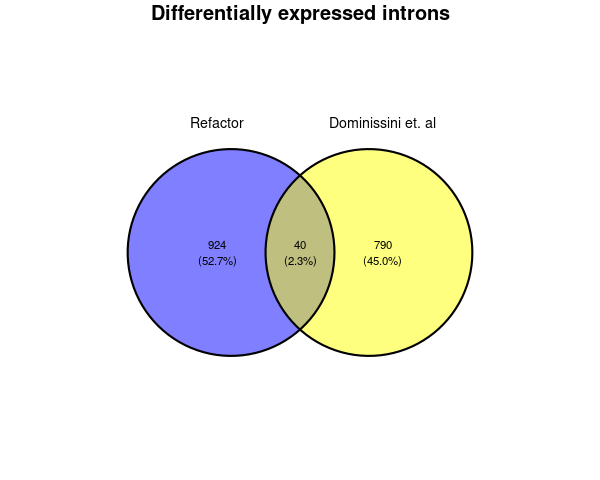

# M6A robustness test

<p markdown="1" align="center">
  
</p>

This repository contains the results of differential gene, isofrom, exon and intron usage in siRNA directed `METTL3` knockdown & control HepG2 cells (n=2) in an attempt to faithfully reproduce the RNA-Seq analysis performed in the Nature paper [Topology of the human and mouse m6A RNA methylomes revealed by m6A-seq](https://www.nature.com/articles/nature11112).

Methods and results are detailed below for posterity, with comments describing missing information that would have aided the analysis from a reviewers perpective. The results from this repository are to be used in conjunction with a M6A peak calling analysis of HepG2 cells, to interrogate correlations between M6A peaks and differential gene/isoform/exon/intron usage, a topic that has 13 [contrasting citations](https://scite.ai/reports/topology-of-the-human-and-WDmMRO?contradicting=true&mentioning=false&page=1&supporting=false) to date.

## Analysis overview

* [Download data](#download-data)
* [Quantification](#quantification)
* [Differentially expressed genes](#differentially-expressed-genes)
* [Differentially expressed isoforms](#differentially-expressed-isoforms)
* [Differentially expressed exons](#differentially-expressed-exons)
* [Differentially expressed introns](#differentially-expressed-introns)
* [Comparison of results](#comparison-of-results)

> Please note: The direction of fold change is with respect to control. I.e a log2FC value of 2 refers to up-regulation in the METTL3 knockdown samples.

# Download data

Raw sequencing data was downloaded using `SRAtools` `fastq-dump` via a singularity container. The nextflow script to download the reads is provided in [`scripts/`](https://github.com/BarryDigby/GSE37001/tree/main/scripts) and the set of commands used is given below:

<details markdown="1">
<summary>Download raw reads</summary>

```bash
singularity pull sratoolkit.img docker://pegi3s:sratoolkit
nextflow -bg run dl_sra.nf --sra_id 'SRP012096' -with-singularity 'sratoolkit.img'
```

</details>

SRA ID's can be mapped to the corresponding experiment metadata using the table below:


|       SRA ID       |   Experimental design  |
|:------------------:|:----------------------:|
| SRR456526.fastq.gz |   METTL3_KD1.fastq.gz  |
| SRR456527.fastq.gz |   METTL3_KD2.fastq.gz  |
| SRR456528.fastq.gz | Mock_control1.fastq.gz |
| SRR456529.fastq.gz | Mock_control2.fastq.gz |

***

Reference genome and GTF files were prepared as per the paper, using `H. sapiens ENSEMBL release 54 (NCBI36/hg18)`.

<details markdown="1">
<summary>Download reference files</summary>

```bash
wget http://ftp.ensembl.org/pub/release-54/fasta/homo_sapiens/dna/Homo_sapiens.NCBI36.54.dna.toplevel.fa.gz
guzip Homo_sapiens.NCBI36.54.dna.toplevel.fa.gz

wget http://ftp.ensembl.org/pub/release-54/gtf/homo_sapiens/Homo_sapiens.NCBI36.54.gtf.gz
gunzip Homo_sapiens.NCBI36.54.gtf.gz
```

</details>

# Quantification

 RNA-Seq analysis was performed using `nf-core/rnaseq v3.1` with default parameters (except for the reference files provided). The `samples.csv` file provided to `nf-core/rnaseq` is given below, of note the dataset is single-end and unstranded:

 | sample        | fastq_1                      | fastq_2 | strandedness |
 |---------------|------------------------------|---------|--------------|
 | METTL3_KD1    | fastq/METTL3_KD1.fastq.gz    |         | unstranded   |
 | METTL3_KD2    | fastq/METTL3_KD2.fastq.gz    |         | unstranded   |
 | Mock_control1 | fastq/Mock_control1.fastq.gz |         | unstranded   |
 | Mock_control2 | fastq/Mock_control2.fastq.gz |         | unstranded   |

***

 <details markdown="1">
 <summary>Nextflow command</summary>

 ```bash
nextflow pull nf-core/rnaseq
nextflow -bg run nf-core/rnaseq -profile singularity --input 'samples.csv' --fasta 'assets/Homo_sapiens.NCBI36.54.dna.toplevel.fa' --gtf 'Homo_sapiens.NCBI36.54.gtf' --max_memory '62.GB' --max_cpus 16
 ```

 </details>


# Differentially expressed genes

Pairwise comparisons of `knockdown` vs `control` populations were generated using `DESeq2` with a simple model design ` ~ condition`.

The `R` code used to generate results are given below:

<details markdown="1">
<summary>Differential gene analysis</summary>

```R
# stage files
meta <- data.frame(row.names=c("METTL3_KD1", "METTL3_KD2", "Mock_control1", "Mock_control2"),
                   "condition"=c("KD", "KD", "CTRL", "CTRL"),
                   "replicates"=as.factor(c("1", "2", "1", "2")))
dir <- "/data/projects/leipzig/results/star_salmon"
files <- file.path(dir, rownames(meta), "quant.sf")
# Use release 54 here *crucial for accurate coordinates across DE analyses
mart <- useMart("ENSEMBL_MART_ENSEMBL",
                dataset="hsapiens_gene_ensembl",
                host="may2009.archive.ensembl.org",
                path="/biomart/martservice",
                archive=FALSE)
tx2gene <- getBM(attributes = c("ensembl_transcript_id", "hgnc_symbol"), mart = mart)
txi <- tximport(files, type = "salmon", tx2gene = tx2gene, txOut = FALSE)
# DDS object
dds <- DESeqDataSetFromTximport(txi, colData = meta, design = ~ condition)
dds$condition <- relevel(dds$condition, ref="CTRL")
dds <- DESeq(dds)
# DGE
res <- results(dds, alpha=0.05, c("condition", "KD", "CTRL"))
res_df <- as.data.frame(res)
# functions
# use paper cutoff here (FC > 2, FDR 5%)
get_upregulated <- function(df){

    key <- intersect(rownames(df)[which(df$log2FoldChange>=2)], rownames(df)[which(df$padj<=0.05)])

    results <- as.data.frame((df)[which(rownames(df) %in% key),])
    results <- results[order(-results$log2FoldChange),]
    return(results)
}
get_downregulated <- function(df){

    key <- intersect(rownames(df)[which(df$log2FoldChange<=-2)], rownames(df)[which(df$padj<=0.05)])

    results <- as.data.frame((df)[which(rownames(df) %in% key),])
    results <- results[order(results$log2FoldChange),]
    return(results)
}
annotate_de_genes <- function(df){

    df$hgnc_symbol <- rownames(df)
    mart <- useMart("ENSEMBL_MART_ENSEMBL",
                dataset="hsapiens_gene_ensembl",
                host="may2009.archive.ensembl.org",
                path="/biomart/martservice",
                archive=FALSE)
    info <- getBM(attributes=c("hgnc_symbol",
                               "ensembl_gene_id",
                               "chromosome_name",
                               "start_position",
                               "end_position",
                               "strand"),
                  filters = c("hgnc_symbol"),
                  values = df$hgnc_symbol,
                  mart = mart,
                  useCache=FALSE)

    tmp <- merge(df, info, by="hgnc_symbol")
    tmp$strand <- gsub("-1", "-", tmp$strand)
    tmp$strand <- gsub("1", "+", tmp$strand)
    tmp$hgnc_symbol <- make.names(tmp$hgnc_symbol, unique = T)
    #tmp <- tmp[!grepl("CHR", tmp$chromosome_name),]

    output_col <- c("hgnc", "ensembl_gene_id", "chromosome", "start", "end", "strand", "log2FC", "pvalue", "padj")
    tmp <- subset(tmp, select=c(hgnc_symbol, ensembl_gene_id, chromosome_name, start_position, end_position, strand, log2FoldChange, pvalue, padj))
    colnames(tmp) <- output_col

    if(min(tmp$Log2FC) > 0){
        tmp <- tmp[order(-tmp$log2FC),]
    }else{
        tmp <- tmp[order(tmp$log2FC),]
    }

    return(tmp)

}
# get up regulated
up <- get_upregulated(res_df)
up$hgnc_symbol <- rownames(up)
up <- annotate_de_genes(up)
# get down regulated
down <- get_downregulated(res_df)
down$hgnc_symbol <- rownames(down)
down <- annotate_de_genes(down)
# not sure why this is not working in the function, re-run to order by LFC
down <- down[order(down$log2FC),]
# write to file
write.table(up, "/data/github/GSE37001/gene/DESeq2_gene_upregulated.txt", sep="\t", quote = FALSE, row.names = FALSE)
write.table(down, "/data/github/GSE37001/gene/DESeq2_gene_downregulated.txt", sep="\t", quote = FALSE, row.names = FALSE)
```

</details>

### Comments

The number of differentially expressed genes returned by the analysis (428) were significantly lower than those reported by the study (1977), despite using the same cut-off values (LFC > 2 & FDR 5%).

Despite the discrepancy in results, this was a relatively simple analysis to perform. The paper stated which reference genome files were used (`ENSEMBL release 54`) which is crucial in returning the same genomic coordinates for M6A peak overlap analysis.

# Differentially expressed isoforms

The analysis was performed using the `DESeq2` workflow above with one change: `txi <- tximport(files, type = "salmon", tx2gene = tx2gene, txOut = TRUE)` to use transcript counts in the analysis instead of gene counts. The workflow is given below.

<details markdown="1">
<summary>Differential isoform analysis</summary>

```R
# same as above, but use TX counts
txi <- tximport(files, type = "salmon", tx2gene = tx2gene, txOut = TRUE)
# DDS object
dds <- DESeqDataSetFromTximport(txi, colData = meta, design = ~ condition )
dds$condition <- relevel(dds$condition, ref="CTRL")
dds <- DESeq(dds)
# DGE
res <- results(dds, alpha=0.05, c("condition", "KD", "CTRL"))
res_df <- as.data.frame(res)
# functions
# use paper cutoff here (FC > 2, FDR 5%)
get_upregulated <- function(df){

    key <- intersect(rownames(df)[which(df$log2FoldChange>=2)], rownames(df)[which(df$padj<=0.05)])

    results <- as.data.frame((df)[which(rownames(df) %in% key),])
    results <- results[order(-results$log2FoldChange),]
    return(results)
}
get_downregulated <- function(df){

    key <- intersect(rownames(df)[which(df$log2FoldChange<=-2)], rownames(df)[which(df$padj<=0.05)])

    results <- as.data.frame((df)[which(rownames(df) %in% key),])
    results <- results[order(results$log2FoldChange),]
    return(results)
}
annotate_de_genes <- function(df){

    df$hgnc_symbol <- rownames(df)
    mart <- useMart("ENSEMBL_MART_ENSEMBL",
                dataset="hsapiens_gene_ensembl",
                host="may2009.archive.ensembl.org",
                path="/biomart/martservice",
                archive=FALSE)
    info <- getBM(attributes=c("ensembl_transcript_id",
                               "ensembl_gene_id",
                               "chromosome_name",
                               "start_position",
                               "end_position",
                               "strand"),
                  filters = c("ensembl_transcript_id"),
                  values = df$ensembl_transcript_id,
                  mart = mart,
                  useCache=FALSE)

    tmp <- merge(df, info, by="ensembl_transcript_id")
    tmp$strand <- gsub("-1", "-", tmp$strand)
    tmp$strand <- gsub("1", "+", tmp$strand)
    tmp$ensembl_transcript_id <- make.names(tmp$ensembl_transcript_id, unique = T)
    #tmp <- tmp[!grepl("CHR", tmp$chromosome_name),]

    output_col <- c("ensembl_transcript_id", "ensembl_gene_id", "chromosome", "start", "end", "strand", "log2FC", "pvalue", "padj")
    tmp <- subset(tmp, select=c(ensembl_transcript_id, ensembl_gene_id, chromosome_name, start_position, end_position, strand, log2FoldChange, pvalue, padj))
    colnames(tmp) <- output_col

    if(min(tmp$Log2FC) > 0){
        tmp <- tmp[order(-tmp$log2FC),]
    }else{
        tmp <- tmp[order(tmp$log2FC),]
    }

    return(tmp)

}
# get up regulated
up <- get_upregulated(res_df)
up$ensembl_transcript_id <- rownames(up)
up <- annotate_de_genes(up)
# get down regulated
down <- get_downregulated(res_df)
down$ensembl_transcript_id <- rownames(down)
down <- annotate_de_genes(down)
down <- down[order(down$log2FC),]
# write to file
write.table(up, "/data/github/GSE37001/isoform/DESeq2_isoform_upregulated.txt", sep="\t", quote = FALSE, row.names = FALSE)
write.table(down, "/data/github/GSE37001/isoform/DESeq2_isoform_downregulated.txt", sep="\t", quote = FALSE, row.names = FALSE)
```

</details>

### Comments

The number of differentially expressed isoforms returned by the analysis (1600) is substantially lower than those reported by the paper (7521).

Recreating this analysis was difficult, in the end I compromised by using `DESeq2`. Per the paper:

> Differentially expressed isoforms: Ensembl gtf file of all human genes (hg18 release 54) was re-processed using Cuffcompare v1.0.3 in order to add the missing tss_id and p_id attributes according to the user guide. The resulting gtf annotation file created by Cuffcompare was used as input to Cuffdiff v1.0.3 tool together with the fragment alignment files. Both Cuffcompare and Cuffdiff are part of the Cufflinks package.

The `Stringtie` and `Ballgown` tuxedo suite superseded `TopHat` and `Cufflinks` originally used in the study. Perhaps advanced users comfortable with the `Tuxedo` suite could faithfully reproduce the differentially expressed isoforms produced by the paper (e.g interpret and implement the `tss_id` and `p_id` values generated by the authors).

# Differentially expressed exons

The standard `DEXSeq` analysis workflow was followed to produce results for differentially expressed exons. Prior to analysis in R, reference GFF files and exon counts were generated. The code is given below.

<details markdown="1">
<summary>Prepare annotation</summary>

```bash
python /home/barry/R/x86_64-pc-linux-gnu-library/4.1/DEXSeq/python_scripts/dexseq_prepare_annotation.py Homo_sapiens.NCBI36.54.gtf Homo_sapiens.NCBI36.54.gff -r no
```

</details>

<details markdown="1">
<summary>Counting Reads</summary>

```bash
python /home/barry/R/x86_64-pc-linux-gnu-library/4.1/DEXSeq/python_scripts/dexseq_count.py Homo_sapiens.NCBI36.54.gff /data/projects/leipzig/results/star_salmon/METTL3_KD1.markdup.sorted.bam METTL3_KD1.txt -r pos -s no -f bam -a 0

python /home/barry/R/x86_64-pc-linux-gnu-library/4.1/DEXSeq/python_scripts/dexseq_count.py Homo_sapiens.NCBI36.54.gff /data/projects/leipzig/results/star_salmon/METTL3_KD2.markdup.sorted.bam METTL3_KD2.txt -r pos -s no -f bam -a 0

python /home/barry/R/x86_64-pc-linux-gnu-library/4.1/DEXSeq/python_scripts/dexseq_count.py Homo_sapiens.NCBI36.54.gff /data/projects/leipzig/results/star_salmon/Mock_control1.markdup.sorted.bam Mock_control1.txt -r pos -s no -f bam -a 0

python /home/barry/R/x86_64-pc-linux-gnu-library/4.1/DEXSeq/python_scripts/dexseq_count.py Homo_sapiens.NCBI36.54.gff /data/projects/leipzig/results/star_salmon/Mock_control2.markdup.sorted.bam Mock_control2.txt -r pos -s no -f bam -a 0
```

</details>

<details markdown="1">
<summary>DEXSeq</summary>

```R
# stage files
inDir = "/data/projects/leipzig/dexseq/"
countFiles = list.files(inDir, pattern=".txt$", full.names=TRUE)
# stage GFF
flattenedFile = list.files(inDir, pattern="gff$", full.names=TRUE)
# define full, null models
formulaFullModel    =  ~ sample + exon + condition:exon
formulaReducedModel =  ~ sample + exon
# dxd object
dxd = DEXSeqDataSetFromHTSeq(
      countFiles,
      sampleData=meta,
      design= ~ sample + exon + condition:exon,
      flattenedfile=flattenedFile )
# relevel, normalize
dxd$condition <- relevel(dxd$condition, ref="CTRL")
dxd <- estimateSizeFactors(dxd)
# gimme power!
BPPARAM = BiocParallel::MulticoreParam(8)
dxd <- estimateDispersions(dxd, formula = formulaFullModel, BPPARAM=BPPARAM)
dxd <- testForDEU(dxd, fullModel = formulaFullModel, reducedModel = formulaReducedModel, BPPARAM = BPPARAM)
dxd <- estimateExonFoldChanges( dxd, fitExpToVar="condition", BPPARAM = BPPARAM, independentFiltering = TRUE)
dex_res <- DEXSeqResults(dxd)
dex_df <- as.data.frame(dex_res)
# subset results
get_upregulated_dex <- function(df){

    key <- intersect(rownames(df)[which(df$log2fold_KD_CTRL>=2)], rownames(df)[which(df$padj<=0.05)])

    results <- as.data.frame((df)[which(rownames(df) %in% key),])
    results <- results[order(-results$log2fold_KD_CTRL),]
    return(results)
}
get_downregulated_dex <- function(df){

    key <- intersect(rownames(df)[which(df$log2fold_KD_CTRL<=-2)], rownames(df)[which(df$padj<=0.05)])

    results <- as.data.frame((df)[which(rownames(df) %in% key),])
    results <- results[order(results$log2fold_KD_CTRL),]
    return(results)
}
# run functions
up_dex <- get_upregulated_dex(dex_df)
down_dex <- get_downregulated_dex(dex_df)
# tidy
up_dex <- subset(up_dex, select=c(groupID, transcripts, featureID, genomicData.seqnames, genomicData.start, genomicData.end, genomicData.strand, log2fold_KD_CTRL, pvalue, padj))
colnames(up_dex) <- c("ensembl_gene_id", "ensembl_transcript_id", "exon_id", "chromosome", "start", "end", "strand", "log2FC", "pvalue", "padj" )
down_dex <- subset(down_dex, select=c(groupID, transcripts, featureID, genomicData.seqnames, genomicData.start, genomicData.end, genomicData.strand, log2fold_KD_CTRL, pvalue, padj))
colnames(down_dex) <- c("ensembl_gene_id", "ensembl_transcript_id", "exon_id", "chromosome", "start", "end", "strand", "log2FC", "pvalue", "padj" )
# write to rda file (transcripts column is a list of transcripts overlapping the exon, very hard to read into R by TSV/CSV)
saveRDS(up_dex, file="/data/github/GSE37001/exon/DEXSeq_exons_upregulated.rda")
saveRDS(down_dex, file="/data/github/GSE37001/exon/DEXSeq_exons_downregulated.rda")
```

</details>

### Comments

The analysis yielded less differentially expressed exons (172) compared to the paper (474). It is less clear why this is the case, as `IHW` nor `apeglm` filtering were applied to the workflow.

The analysis was straight forward, the information provided by the paper was sufficient to perfrom the analysis.

# Differentially expressed introns

The methods section of the paper states they used a customised in-house script to prepare introns for DESeq. I have decided to reformat the reference GTF file to contain introns (not exons) and use this as the starting point for a `DEXSeq` analysis. In theory, this should work the exact same, producing differentially expressed introns as outputs of the analysis. Any criticisms of the approach taken with the analysis are welcome!

<details markdown="1">
<summary>Extract introns from GTF</summary>

```R
library(GenomicFeatures)
library(rtracklayer)
txdb <- makeTxDbFromGFF('/data/projects/leipzig/introns/Homo_sapiens.NCBI36.54.gtf')
introns <- intronicParts(txdb)
rtracklayer::export(introns, "/data/projects/leipzig/introns/introns.gtf")
```

</details>

Next, using a customised version of `DEXSeq` `prepare_annotations.py` (available in [`scripts/`](https://github.com/BarryDigby/GSE37001/tree/main/scripts)), produce a GFF file containing non-overlapping introns for `DEXSeq` analysis. (The results will follow the naming convention 'exon', thus they have been edited within the R script to output 'intron').

<details markdown="1">
<summary>Prepare (intron) annotations</summary>

```bash
sed 's/tx_name/transcript_id/g' introns.gtf > introns_rename.gtf
python prepare_annotation_introns.py introns_rename.gtf introns.gff -r no
```

</details>

Finally, use the sequencing BAM files in conjunction with `dexseq_count.py` to produce counts for each intron.

<details markdown="1">
<summary>Counting Reads</summary>

```bash
python /home/barry/R/x86_64-pc-linux-gnu-library/4.1/DEXSeq/python_scripts/dexseq_count.py introns.gff /data/projects/leipzig/results/star_salmon/METTL3_KD1.markdup.sorted.bam METTL3_KD1.txt -r pos -s no -f bam -a 0

python /home/barry/R/x86_64-pc-linux-gnu-library/4.1/DEXSeq/python_scripts/dexseq_count.py introns.gff /data/projects/leipzig/results/star_salmon/METTL3_KD2.markdup.sorted.bam METTL3_KD2.txt -r pos -s no -f bam -a 0

python /home/barry/R/x86_64-pc-linux-gnu-library/4.1/DEXSeq/python_scripts/dexseq_count.py introns.gff /data/projects/leipzig/results/star_salmon/Mock_control1.markdup.sorted.bam Mock_control1.txt -r pos -s no -f bam -a 0

python /home/barry/R/x86_64-pc-linux-gnu-library/4.1/DEXSeq/python_scripts/dexseq_count.py introns.gff /data/projects/leipzig/results/star_salmon/Mock_control2.markdup.sorted.bam Mock_control2.txt -r pos -s no -f bam -a 0
```

</details>


<details markdown="1">
<summary>DEXSeq (introns)</summary>

```R
# stage files
inDir = "/data/projects/leipzig/introns/"
countFiles = list.files(inDir, pattern=".txt$", full.names=TRUE)
# stage GFF
flattenedFile = list.files(inDir, pattern="gff$", full.names=TRUE)
# define full, null models
formulaFullModel    =  ~ sample + exon + condition:exon
formulaReducedModel =  ~ sample + exon
# dxd object
dxd = DEXSeqDataSetFromHTSeq(
      countFiles,
      sampleData=meta,
      design= ~ sample + exon + condition:exon,
      flattenedfile=flattenedFile)
# relevel, normalize
dxd$condition <- relevel(dxd$condition, ref="CTRL")
dxd <- estimateSizeFactors(dxd)
# gimme power!
BPPARAM = BiocParallel::MulticoreParam(8)
dxd <- estimateDispersions(dxd, formula = formulaFullModel, BPPARAM=BPPARAM)
dxd <- testForDEU(dxd, fullModel = formulaFullModel, reducedModel = formulaReducedModel, BPPARAM = BPPARAM)
dxd <- estimateExonFoldChanges( dxd, fitExpToVar="condition", BPPARAM = BPPARAM, independentFiltering = TRUE)
dex_res <- DEXSeqResults(dxd)
dex_df <- as.data.frame(dex_res)
# subset results
get_upregulated_dex <- function(df){

    key <- intersect(rownames(df)[which(df$log2fold_KD_CTRL>=2)], rownames(df)[which(df$padj<=0.05)])

    results <- as.data.frame((df)[which(rownames(df) %in% key),])
    results <- results[order(-results$log2fold_KD_CTRL),]
    return(results)
}
get_downregulated_dex <- function(df){

    key <- intersect(rownames(df)[which(df$log2fold_KD_CTRL<=-2)], rownames(df)[which(df$padj<=0.05)])

    results <- as.data.frame((df)[which(rownames(df) %in% key),])
    results <- results[order(results$log2fold_KD_CTRL),]
    return(results)
}
# run functions
up_dex <- get_upregulated_dex(dex_df)
down_dex <- get_downregulated_dex(dex_df)
# tidy
up_dex <- subset(up_dex, select=c(groupID, transcripts, featureID, genomicData.seqnames, genomicData.start, genomicData.end, genomicData.strand, log2fold_KD_CTRL, pvalue, padj))
colnames(up_dex) <- c("ensembl_gene_id", "ensembl_transcript_id", "intron_id", "chromosome", "start", "end", "strand", "log2FC", "pvalue", "padj" )
down_dex <- subset(down_dex, select=c(groupID, transcripts, featureID, genomicData.seqnames, genomicData.start, genomicData.end, genomicData.strand, log2fold_KD_CTRL, pvalue, padj))
colnames(down_dex) <- c("ensembl_gene_id", "ensembl_transcript_id", "intron_id", "chromosome", "start", "end", "strand", "log2FC", "pvalue", "padj" )
# write to rda file (transcripts column is a list of transcripts overlapping the exon, very hard to read into R by TSV/CSV)
saveRDS(up_dex, file="/data/github/GSE37001/intron/DEXSeq_introns_upregulated.rda")
saveRDS(down_dex, file="/data/github/GSE37001/intron/DEXSeq_introns_downregulated.rda")
```

</details>

### Comments

The analsyis yielded 964 differentially expressed introns, which was less than the authors produced (2672). The authors were not transparent in their methods used to count introns (the dreaded 'in-house script') however I am reasonably confident that my methods in generating intron counts were correct. Interestingly the authors decided to use `DESeq` for the analysis over `DEXSeq`. They did not state why this was the case, and strikes me as unusual. Therefore this section of the analysis is left open to interpretation and clouds reproducibility.

# Comparison of results

<p markdown="1" align="center">
  
</p>

The supplementary table caption is slightly misleading. After downloading the supplementary materials (4 files, containing DE genes, isoforms, introns and exons) and inspecting the files, it immediately became apparent that the numbers stated in the table refer to the number of DE RNA molecules **before filtering** (i.e LFC > 0 , LFC < 0 , pval=0.05). This explains the large discrepancy in the numbers originally reported in this analysis above.

***

To assess the degree of concordance in each of the 4 analyses, filtering (LFC >2 , FDR 5%) was applied to the supplementary material datasets and compared with the results of our analysis.

## Gene

We report 428 differentially expressed genes in our study (LFC 2, FDR 5%). After applying the same filtering methods to the supplementary gene file, there were 470 differentially expressed genes, 336 of which were common amongst the datasets.

<p markdown="1" align="center">
  
</p>

A dataframe containing summary statistics for differentially expressed genes found in both analyses can be found under [`gene/DE_genes.txt`](https://github.com/BarryDigby/GSE37001/tree/main/gene/DE_genes.txt). Results have been ordered according to the union of results, thereafter genes with NA values represent the difference between sets.

## Isoform

We report 1600 differentially expressed transcripts in our study (LFC 2, FDR 5%). After applying the same filtering methods to the supplementary isoforms file, there were 2020 differentially expressed transcripts, 271 of which were common amongst the datasets.

<p markdown="1" align="center">
  
</p>

A dataframe containing summary statistics for differentially expressed transcripts found in both analyses can be found under [`isoform/DE_isoforms.txt`](https://github.com/BarryDigby/GSE37001/tree/main/isoform/DE_isoforms.txt). Results have been ordered according to the union of results, thereafter genes with NA values represent the difference between sets.

> Please note that lnFC values from `Cufflinks` of `1.79769e+308` were converted to `Inf` to stay consistent with the master gene set. `1.79769e+308` represents lnFC values derived from dividing by 0.

## Exons

We report 172 differentially expressed exons in our study (LFC 2, FDR 5%). After applying the same filtering methods to the supplementary exons file, there were 176 differentially expressed exons, 27 of which were common amongst the datasets.

<p markdown="1" align="center">
  
</p>

A dataframe containing summary statistics for differentially expressed exons found in both analyses can be found under [`exon/DE_exons.txt`](https://github.com/BarryDigby/GSE37001/tree/main/exon/DE_exons.txt). Results have been ordered according to the union of results, thereafter genes with NA values represent the difference between sets.

> There were discrepancies between the naming convention of `GeneID:ExonNumber`, most likely due to using different versions of `DEXSeq`.

## Introns

We report 964 differentially expressed introns in our study (LFC 2, FDR 5%). After applying the same filtering methods to the supplementary introns file, there were 830 differentially expressed introns, 40 of which were common amongst the datasets.

<p markdown="1" align="center">
  
</p>

A dataframe containing summary statistics for differentially expressed introns found in both analyses can be found under [`intron/DE_introns.txt`](https://github.com/BarryDigby/GSE37001/tree/main/exon/DE_exons.txt). Results have been ordered according to the union of results, thereafter genes with NA values represent the difference between sets.


# R Session

```R
R version 4.1.0 (2021-05-18)
Platform: x86_64-pc-linux-gnu (64-bit)
Running under: Ubuntu 20.04.2 LTS

Matrix products: default
BLAS:   /usr/lib/x86_64-linux-gnu/blas/libblas.so.3.9.0
LAPACK: /usr/lib/x86_64-linux-gnu/lapack/liblapack.so.3.9.0

locale:
 [1] LC_CTYPE=en_IE.UTF-8       LC_NUMERIC=C               LC_TIME=en_IE.UTF-8        LC_COLLATE=en_IE.UTF-8    
 [5] LC_MONETARY=en_IE.UTF-8    LC_MESSAGES=en_IE.UTF-8    LC_PAPER=en_IE.UTF-8       LC_NAME=C                 
 [9] LC_ADDRESS=C               LC_TELEPHONE=C             LC_MEASUREMENT=en_IE.UTF-8 LC_IDENTIFICATION=C       

attached base packages:
 [1] grid      parallel  stats4    stats     graphics  grDevices utils     datasets  methods   base     

other attached packages:
 [1] UpSetR_1.4.0                fgsea_1.18.0                ggvenn_0.1.8                ggVennDiagram_1.1.2        
 [5] devtools_2.4.2              usethis_2.0.1               VennDiagram_1.6.20          futile.logger_1.4.3        
 [9] rtracklayer_1.52.0          DEXSeq_1.38.0               BiocParallel_1.26.0         ggpubr_0.4.0               
[13] forcats_0.5.1               stringr_1.4.0               purrr_0.3.4                 readr_1.4.0                
[17] tidyr_1.1.3                 tibble_3.1.2                tidyverse_1.3.1             clusterProfiler_4.0.0      
[21] GenomicFeatures_1.44.0      AnnotationDbi_1.54.1        PCAtools_2.4.0              ggrepel_0.9.1              
[25] ggplot2_3.3.3               pheatmap_1.0.12             RColorBrewer_1.1-2          DESeq2_1.32.0              
[29] SummarizedExperiment_1.22.0 Biobase_2.52.0              MatrixGenerics_1.4.0        matrixStats_0.59.0         
[33] GenomicRanges_1.44.0        GenomeInfoDb_1.28.0         IRanges_2.26.0              S4Vectors_0.30.0           
[37] BiocGenerics_0.38.0         gplots_3.1.1                rhdf5_2.36.0                tximport_1.20.0            
[41] biomaRt_2.48.0              dplyr_1.0.6                 DT_0.18                     apeglm_1.14.0              
[45] IHW_1.20.0                 

loaded via a namespace (and not attached):
  [1] rappdirs_0.3.3            coda_0.19-4               bit64_4.0.5               knitr_1.33               
  [5] irlba_2.3.3               DelayedArray_0.18.0       data.table_1.14.0         hwriter_1.3.2            
  [9] KEGGREST_1.32.0           RCurl_1.98-1.3            generics_0.1.0            ScaledMatrix_1.0.0       
 [13] callr_3.7.0               lambda.r_1.2.4            cowplot_1.1.1             RSQLite_2.2.7            
 [17] shadowtext_0.0.8          proxy_0.4-26              bit_4.0.4                 enrichplot_1.12.0        
 [21] xml2_1.3.2                lubridate_1.7.10          assertthat_0.2.1          viridis_0.6.1            
 [25] xfun_0.23                 hms_1.1.0                 jquerylib_0.1.4           evaluate_0.14            
 [29] fansi_0.5.0               restfulr_0.0.13           progress_1.2.2            caTools_1.18.2           
 [33] dbplyr_2.1.1              readxl_1.3.1              igraph_1.2.6              DBI_1.1.1                
 [37] geneplotter_1.70.0        htmlwidgets_1.5.3         ellipsis_0.3.2            crosstalk_1.1.1          
 [41] backports_1.2.1           annotate_1.70.0           sparseMatrixStats_1.4.0   vctrs_0.3.8              
 [45] remotes_2.4.0             abind_1.4-5               cachem_1.0.5              withr_2.4.2              
 [49] RVenn_1.1.0               ggforce_0.3.3             bdsmatrix_1.3-4           GenomicAlignments_1.28.0
 [53] treeio_1.16.1             fdrtool_1.2.16            prettyunits_1.1.1         DOSE_3.18.0              
 [57] ape_5.5                   lazyeval_0.2.2            crayon_1.4.1              genefilter_1.74.0        
 [61] labeling_0.4.2            units_0.7-2               pkgconfig_2.0.3           slam_0.1-48              
 [65] tweenr_1.0.2              pkgload_1.2.1             nlme_3.1-152              rlang_0.4.11             
 [69] lifecycle_1.0.0           downloader_0.4            filelock_1.0.2            BiocFileCache_2.0.0      
 [73] modelr_0.1.8              rsvd_1.0.5                rprojroot_2.0.2           cellranger_1.1.0         
 [77] polyclip_1.10-0           Matrix_1.3-4              aplot_0.0.6               carData_3.0-4            
 [81] lpsymphony_1.20.0         Rhdf5lib_1.14.1           reprex_2.0.0              processx_3.5.2           
 [85] png_0.1-7                 viridisLite_0.4.0         rjson_0.2.20              bitops_1.0-7             
 [89] KernSmooth_2.23-20        rhdf5filters_1.4.0        Biostrings_2.60.1         blob_1.2.1               
 [93] DelayedMatrixStats_1.14.0 classInt_0.4-3            qvalue_2.24.0             rstatix_0.7.0            
 [97] ggsignif_0.6.1            beachmat_2.8.0            scales_1.1.1              memoise_2.0.0            
[101] magrittr_2.0.1            plyr_1.8.6                zlibbioc_1.38.0           compiler_4.1.0           
[105] scatterpie_0.1.6          dqrng_0.3.0               tinytex_0.32              BiocIO_1.2.0             
[109] bbmle_1.0.23.1            Rsamtools_2.8.0           cli_2.5.0                 XVector_0.32.0           
[113] ps_1.6.0                  patchwork_1.1.1           formatR_1.11              MASS_7.3-54              
[117] tidyselect_1.1.1          stringi_1.6.2             emdbook_1.3.12            yaml_2.2.1               
[121] GOSemSim_2.18.0           BiocSingular_1.8.1        locfit_1.5-9.4            sass_0.4.0               
[125] fastmatch_1.1-0           tools_4.1.0               rio_0.5.26                rstudioapi_0.13          
[129] foreign_0.8-81            gridExtra_2.3             farver_2.1.0              ggraph_2.0.5             
[133] digest_0.6.27             rvcheck_0.1.8             BiocManager_1.30.15       Rcpp_1.0.6               
[137] car_3.0-10                broom_0.7.6               httr_1.4.2                sf_1.0-0                 
[141] colorspace_2.0-1          rvest_1.0.0               XML_3.99-0.6              fs_1.5.0                 
[145] splines_4.1.0             statmod_1.4.36            tidytree_0.3.4            graphlayouts_0.7.1       
[149] sessioninfo_1.1.1         xtable_1.8-4              futile.options_1.0.1      jsonlite_1.7.2           
[153] ggtree_3.0.2              tidygraph_1.2.0           testthat_3.0.2            R6_2.5.0                 
[157] pillar_1.6.1              htmltools_0.5.1.1         glue_1.4.2                fastmap_1.1.0            
[161] class_7.3-19              pkgbuild_1.2.0            mvtnorm_1.1-2             utf8_1.2.1               
[165] lattice_0.20-44           bslib_0.2.5.1             numDeriv_2016.8-1.1       curl_4.3.1               
[169] gtools_3.9.2              zip_2.2.0                 GO.db_3.13.0              openxlsx_4.2.3           
[173] survival_3.2-11           rmarkdown_2.8             desc_1.3.0                munsell_0.5.0            
[177] e1071_1.7-7               DO.db_2.9                 GenomeInfoDbData_1.2.6    haven_2.4.1              
[181] reshape2_1.4.4            gtable_0.3.0             
```
