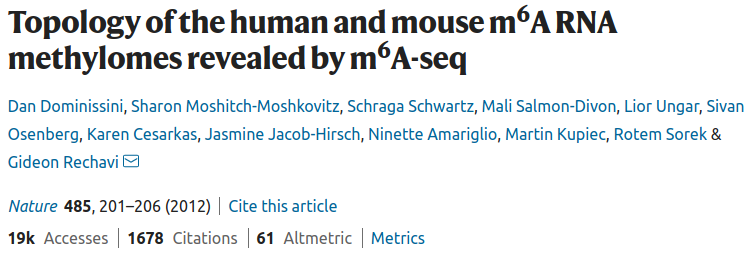

# M6A robustness test

<p markdown="1" align="center">
  
</p>

This repository contains the results of differential gene, isofrom, exon and intron usage in siRNA directed `METTL3` knockdown & control HepG2 cells (n=2) in an attempt to faithfully reproduce the RNA-Seq analysis performed in the Nature paper [Topology of the human and mouse m6A RNA methylomes revealed by m6A-seq](https://www.nature.com/articles/nature11112).

Methods and results are detailed below for posterity, with comments describing missing information that would have aided the analysis from a reviewers perpective. The results from this repository are to be used in conjunction with a M6A peak calling analysis of HepG2 cells, to interrogate correlations between M6A peaks and differential gene/isoform/exon/intron usage, a topic that has 13 [contrasting citations](https://scite.ai/reports/topology-of-the-human-and-WDmMRO?contradicting=true&mentioning=false&page=1&supporting=false) to date.

## Analysis overview

* [Download data](#download-data)
* [Quantification](#quantification)
* [Differentially expressed genes](#differentially-expressed-genes)
* [Differentially expressed isoforms](#differentially-expressed-isoforms)
* [Differentially expressed exons](#differentially-expressed-exons)
* [Differentially expressed introns](#differentially-expressed-introns)

# Download data

Raw sequencing data was downloaded using `SRAtools` `fastq-dump` via a singularity container. The nextflow script to download the reads is provided in [`scripts/`](https://github.com/BarryDigby/GSE37001/tree/main/scripts) and the set of commands used is given below:

<details markdown="1">
<summary>Download raw reads</summary>

```bash
singularity pull sratoolkit.img docker://pegi3s:sratoolkit
nextflow -bg run dl_sra.nf --sra_id 'SRP012096' -with-singularity 'sratoolkit.img'
```

</details>

SRA ID's can be mapped to the corresponding experiment metadata using the table below:


|       SRA ID       |   Experimental design  |
|:------------------:|:----------------------:|
| SRR456526.fastq.gz |   METTL3_KD1.fastq.gz  |
| SRR456527.fastq.gz |   METTL3_KD2.fastq.gz  |
| SRR456528.fastq.gz | Mock_control1.fastq.gz |
| SRR456529.fastq.gz | Mock_control2.fastq.gz |

***

Reference genome and GTF files were prepared as per the paper, using `H. sapiens ENSEMBL release 54 (NCBI36/hg18)`.

<details markdown="1">
<summary>Download reference files</summary>

```bash
wget http://ftp.ensembl.org/pub/release-54/fasta/homo_sapiens/dna/Homo_sapiens.NCBI36.54.dna.toplevel.fa.gz
guzip Homo_sapiens.NCBI36.54.dna.toplevel.fa.gz

wget http://ftp.ensembl.org/pub/release-54/gtf/homo_sapiens/Homo_sapiens.NCBI36.54.gtf.gz
gunzip Homo_sapiens.NCBI36.54.gtf.gz
```

</details>

# Quantification

 RNA-Seq analysis was performed using `nf-core/rnaseq v3.1` with default parameters (except for the reference files provided). The `samples.csv` file provided to `nf-core/rnaseq` is given below, of note the dataset is single-end and unstranded:

 | sample        | fastq_1                      | fastq_2 | strandedness |
 |---------------|------------------------------|---------|--------------|
 | METTL3_KD1    | fastq/METTL3_KD1.fastq.gz    |         | unstranded   |
 | METTL3_KD2    | fastq/METTL3_KD2.fastq.gz    |         | unstranded   |
 | Mock_control1 | fastq/Mock_control1.fastq.gz |         | unstranded   |
 | Mock_control2 | fastq/Mock_control2.fastq.gz |         | unstranded   |

***

 <details markdown="1">
 <summary>Nextflow command</summary>

 ```bash
nextflow pull nf-core/rnaseq
nextflow -bg run nf-core/rnaseq -profile singularity --input 'samples.csv' --fasta 'assets/Homo_sapiens.NCBI36.54.dna.toplevel.fa' --gtf 'Homo_sapiens.NCBI36.54.gtf' --max_memory '62.GB' --max_cpus 16
 ```

 </details>


# Differentially expressed genes

# Differentially expressed isoforms

# Differentially expressed exons

<details markdown="1">
<summary>Prepare annotation</summary>

```bash
python /home/barry/R/x86_64-pc-linux-gnu-library/4.1/DEXSeq/python_scripts/dexseq_prepare_annotation.py Homo_sapiens.NCBI36.54.gtf Homo_sapiens.NCBI36.54.gff -r no
```

</details>

<details markdown="1">
<summary>Counting Reads</summary>

```bash
python /home/barry/R/x86_64-pc-linux-gnu-library/4.1/DEXSeq/python_scripts/dexseq_count.py Homo_sapiens.NCBI36.54.gff /data/projects/leipzig/results/star_salmon/METTL3_KD1.markdup.sorted.bam METTL3_KD1.txt -r pos -s no -f bam -a 0

python /home/barry/R/x86_64-pc-linux-gnu-library/4.1/DEXSeq/python_scripts/dexseq_count.py Homo_sapiens.NCBI36.54.gff /data/projects/leipzig/results/star_salmon/METTL3_KD2.markdup.sorted.bam METTL3_KD2.txt -r pos -s no -f bam -a 0

python /home/barry/R/x86_64-pc-linux-gnu-library/4.1/DEXSeq/python_scripts/dexseq_count.py Homo_sapiens.NCBI36.54.gff /data/projects/leipzig/results/star_salmon/Mock_control1.markdup.sorted.bam Mock_control1.txt -r pos -s no -f bam -a 0

python /home/barry/R/x86_64-pc-linux-gnu-library/4.1/DEXSeq/python_scripts/dexseq_count.py Homo_sapiens.NCBI36.54.gff /data/projects/leipzig/results/star_salmon/Mock_control2.markdup.sorted.bam Mock_control2.txt -r pos -s no -f bam -a 0
```

</details>

# Differentially expressed introns

The methods section of the paper states they used a customised in-house script to prepare introns for DESeq. I have decided to reformat the reference GTF file to contain introns (not exons) and use this as the starting point for a `DEXSeq` analysis. In theory, this should work the exact same, producing differentially expressed introns as outputs of the analysis. Any criticisms of the approach taken with the analysis are welcome!

<details markdown="1">
<summary>Extract introns from GTF</summary>

```R
library(GenomicFeatures)
library(rtracklayer)
txdb <- makeTxDbFromGFF('/data/projects/leipzig/introns/Homo_sapiens.NCBI36.54.gtf')
introns <- intronicParts(txdb)
rtracklayer::export(introns, "/data/projects/leipzig/introns/introns.gtf")
```

</details>

Next, using a customised version of `DEXSeq` `prepare_annotations.py` (available in [`scripts/`](https://github.com/BarryDigby/GSE37001/tree/main/scripts)), produce a GFF file containing non-overlapping introns for `DEXSeq` analysis.

<details markdown="1">
<summary>Prepare (intron) annotations</summary>

```bash
sed 's/tx_name/transcript_id/g' introns.gtf > introns_rename.gtf
python prepare_annotation_introns.py introns_rename.gtf introns.gff -r no
```

</details>

Finally, use the sequencing BAM files in conjunction with `dexseq_count.py` to produce counts for each intron.

<details markdown="1">
<summary>Counting Reads</summary>

```bash
python /home/barry/R/x86_64-pc-linux-gnu-library/4.1/DEXSeq/python_scripts/dexseq_count.py introns.gff /data/projects/leipzig/results/star_salmon/METTL3_KD1.markdup.sorted.bam METTL3_KD1.txt -r pos -s no -f bam -a 0

python /home/barry/R/x86_64-pc-linux-gnu-library/4.1/DEXSeq/python_scripts/dexseq_count.py introns.gff /data/projects/leipzig/results/star_salmon/METTL3_KD2.markdup.sorted.bam METTL3_KD2.txt -r pos -s no -f bam -a 0

python /home/barry/R/x86_64-pc-linux-gnu-library/4.1/DEXSeq/python_scripts/dexseq_count.py introns.gff /data/projects/leipzig/results/star_salmon/Mock_control1.markdup.sorted.bam Mock_control1.txt -r pos -s no -f bam -a 0

python /home/barry/R/x86_64-pc-linux-gnu-library/4.1/DEXSeq/python_scripts/dexseq_count.py introns.gff /data/projects/leipzig/results/star_salmon/Mock_control2.markdup.sorted.bam Mock_control2.txt -r pos -s no -f bam -a 0
```

</details>
